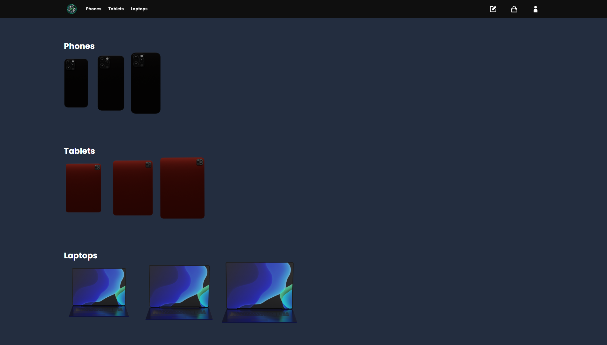
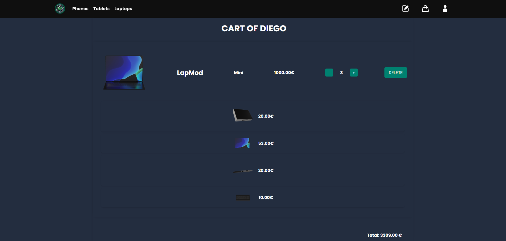
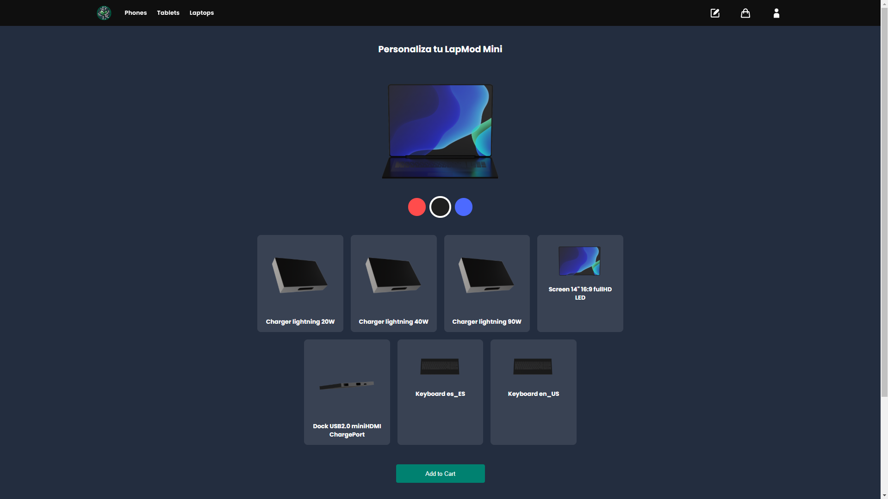

# Ecomods


**Ecomods** is an **e-commerce** web application built from the ground up **without any pre-made template**, offering a **fully responsive** design. Here, users can **build modular devices**—phones, tablets, and laptops—by adding or swapping modules (cameras, screens, keyboards, etc.). The entire application is custom-coded in **Django**, featuring:

- **Modular device building** and real-time cart management  
- **Switchable metric systems** (SI or Imperial) and currency conversions (EUR ↔ USD)  
- **Secure authentication** (via email or Google OAuth2)  
- **Custom `.env`** for sensitive credentials  
- **Live demo** at [ecomods.pythonanywhere.com](https://ecomods.pythonanywhere.com)
- **Demo Video**: [Watch the Ecomods Demo](https://www.youtube.com/watch?v=your_demo_video_link)

---

## Table of Contents

1. [About Ecomods](#about-ecomods)  
2. [Key Features](#key-features)  
3. [Project Structure](#project-structure)  
4. [Screenshots](#screenshots)  
5. [Installation (Windows Only)](#installation-windows-only)  
   - [Local Setup](#local-setup)  
   - [Docker Setup](#docker-setup)  
6. [Usage](#usage)  
7. [Author & License](#author--license)

---

## About Ecomods

**Ecomods** is designed for **sustainable** and **customizable** device shopping. All UI components—HTML, CSS, and JavaScript—are written from scratch to ensure a **100% responsive** experience, with no templates or scaffolds used.

You can **add to cart** or **build**:

- **Phones**: With multiple color variants and modules (camera, screen size, etc.)  
- **Tablets**: Choose additional ports, camera types, etc.  
- **Laptops**: Screen modules, keyboard modules, and more  

> **Note**: If you only want to inspect the functionality (without configuring your own `.env`), visit the **live demo** at **[ecomods.pythonanywhere.com](https://ecomods.pythonanywhere.com)**.

---

## Key Features

1. **Modular Device Building**  
   - Select and customize phones, tablets, or laptops. Add modules like cameras, charging ports, or keyboards.  

2. **Fully Responsive & Custom-Designed**  
   - Every part of the UI is built from scratch (HTML/CSS/JS). No external scaffolding or templates.

3. **Measurement & Currency Switching**  
   - Instantly toggle between **SI (Europa)** and **Imperial (América del Norte)**.
   - Auto-convert product dimensions (mm ↔ inch) and currency (EUR ↔ USD) with an exchange-rate API.

4. **Cart & Checkout Flow**  
   - Real-time cart updates, quantity adjustments, item removals, and total price calculations.

5. **Secure Authentication**  
   - Email-based registration (SMTP settings in `.env`).
   - Google OAuth2 integration through `social-auth-app-django`.

6. **Translations (Optional)**  
   - Two languages available: English (`en`) and Spanish (`es`).
   - JavaScript strings also translated via `djangojs`.

7. **`.env` Configuration**  
   - `.env` is **not** committed, keeping sensitive data out of source control.
   - Must contain `SECRET_KEY`, email credentials, and OAuth keys for Google authentication.

---

## Project Structure

A concise view of **`ecomods/web`** (where most code and configuration files live):

```
ecomods/
└── web/
    ├── .env
    ├── docker-compose.yml
    ├── Dockerfile
    ├── manage.py
    ├── requirements.txt
    ├── app/
    │   ├── static/
    │   ├── templates/
    │   ├── migrations/
    │   ├── models.py
    │   ├── views.py
    │   └── pipeline.py
    ├── locale/
    │   ├── en/
    │   │   └── LC_MESSAGES/
    │   │       ├── django.po
    │   │       └── djangojs.po
    │   └── es/
    │       └── LC_MESSAGES/
    │           ├── django.po
    │           └── djangojs.po
    └── web/
        ├── settings.py
        ├── urls.py
        └── wsgi.py
```

---

## Screenshots

1. **Home Page**  
   

2. **Cart Page**  
   

3. **Device Build Flow**  
   

---

## Installation (Windows Only)

Below are **Windows-specific** instructions to run Ecomods locally or via Docker, given that all key files (`Dockerfile`, `docker-compose.yml`, `requirements.txt`) are in `ecomods/web`.

### Local Setup

1. **Clone the Repository**  
   ```powershell
   git clone https://github.com/diegomerinx/Ecomods.git
   ```
   *(Adjust URL if needed.)*

2. **Create a Virtual Environment**  
   ```powershell
   cd ecomods\web
   python -m venv venv
   .\venv\Scripts\activate
   ```

3. **Install Dependencies**  
   ```powershell
   python -m pip install --upgrade pip
   pip install -r requirements.txt
   ```

4. **Configure `.env`**  
   - In the same folder as `manage.py`, create a file named `.env`.  
   - Fill it with credentials (example):
     ```plaintext
     SECRET_KEY=your_super_secret_key
     DEBUG=True
     EMAIL_HOST_USER=your_email@gmail.com
     EMAIL_HOST_PASSWORD=your_smtp_password
     SOCIAL_AUTH_GOOGLE_OAUTH2_KEY=your_google_client_id
     SOCIAL_AUTH_GOOGLE_OAUTH2_SECRET=your_google_client_secret
     ```
   - **Important**: This file `.env` is excluded from version control.

5. **Run Migrations**  
   ```powershell
   python manage.py migrate
   ```

6. **Start the Server**  
   ```powershell
   python manage.py runserver
   ```
   - Open [http://127.0.0.1:8000](http://127.0.0.1:8000).

### Docker Setup

1. **Install Docker Desktop** (for Windows)  
   - [Download Docker Desktop](https://www.docker.com/products/docker-desktop)

2. **Build & Start Containers**  
   ```powershell
   cd ecomods\web
   docker-compose up --build
   ```
   - This spins up two containers: **`web`** (Django) and **`db`** (PostgreSQL).

3. **Initialize the Database**  
   - Once containers are running, open PowerShell or CMD:
     ```powershell
     docker exec -it web-web-1 bash
     python manage.py migrate
     python manage.py createsuperuser
     exit
     ```
     *(Adjust container name if different.)*

4. **Access the App**  
   - [http://127.0.0.1:8000](http://127.0.0.1:8000) by default.  
   - Code changes will update automatically if you have volume mounting set up in `docker-compose.yml`.

---

## Usage

Once the server (or Docker containers) is running:

1. **Home Page**: Browse Phones, Tablets, or Laptops.  
2. **Select a Product**: Go to the build page to add modules or directly view existing product details.  
3. **Toggle Metric/Currency**: Switch between **SI (Europa)** and **Imperial (América del Norte)** for dimension & price updates.  
4. **Add to Cart**: Adjust quantities, remove items, or proceed to checkout flow.  
5. **User Management**:  
   - Sign up via email or Google OAuth2 (if you’ve set up those credentials in `.env`).  
   - Manage profile settings, like user info and profile images.

> **Instant Demo**: Try [ecomods.pythonanywhere.com](https://ecomods.pythonanywhere.com) without any local configuration.
